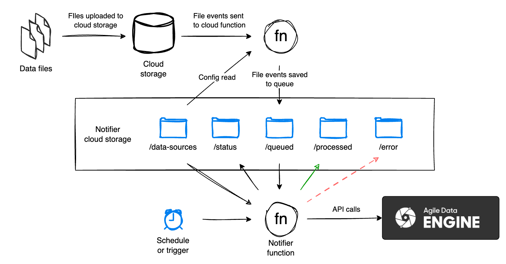

# Introduction
This repository contains a reference solution for notifying incoming source data files for Agile Data Engine Notify API (https://docs.agiledataengine.com/docs/notify-api-saas). 

**The repository is provided for reference purposes only and the solution may require modifications to fit your use case. Note that this solution is not part of the Agile Data Engine product. Please use at your own caution.**

**Contents:**
- Terraform templates for deploying required resources in the cloud of your choice (AWS, Azure or GCP)
- Python functions code for the notifier

# Notifier architecture & process
Reference Notifier solution architecture in high level:



## Notifying process

1. Source data files are created into cloud storage by an external process (i.e. not Agile Data Engine nor the Notifier).
2. File events are sent to a function in the cloud. Implementation details differ from cloud to cloud.
3. Function will read configuration YAML-files from /data-sources.
    - Based on the configuration, events are added to /queue folder in JSON-format. These event files contain the event data, such as location of the original file.
    - Configuration YAML-file is used to divide events to correct foldering within the queue folder
4. Another function is either scheduled or triggered to continue the notifying process. This function:
    - Processes the queue for new file events
    - Notifies events to ADE Notify API based on the set configuration
    - Logs status and/or error based on the notifying status
    - Moves notified file events to /notified

# Data source configuration
Configure data sources into configuration files in YAML format. 

See configuration examples in [config/example_1.yaml](config/example_1.yaml) and [config/example_2.yaml](config/example_2.yaml). These YAML files can be split into multiple files depending on the requirements. YAML files can be named freely.

The configuration format is as follows:

```YAML
parameters:
  max_files_per_manifest: <value>
schedules:
  - schedule_id: <value>
    name: <value>
    cron: <value>
source_systems:
  - ade_source_system: <value>
    <attributes>
    entities:
      - ade_source_entity: <value>
        file_location: <value>
        <attributes>
```

## Parameters

| Attribute | Mandatory | Description |
| - | - | - |
| `parameters` | Yes | A list of top-level parameters. |
| `max_files_per_manifest` | Yes | Specifies the maximum number of files that can be included in a single manifest. If more files are queued, file paths are split into multiple manifests. Typically one file load statement is executed per manifest (e.g. COPY INTO), however this varies by target database product. |

If you split the configuration into multiple YAML files, set the parameters list in only one file.

## Schedules

Notify triggers are generated based on this configuration. Define schedules here and refer to them from the source system or entity configurations.

Schedule lists can be split into multiple YAML files but the ids and names must be unique.

| Attribute | Mandatory | Description |
| - | - | - |
| `schedules` | No | A list of schedules. Schedules can be omitted if triggering the notification of queued files is done with some other method. |
| `schedule_id` | Yes | Unique id for the schedule used for referencing from the source system or entity configurations. |
| `name` | Yes | Unique name for the schedule. This is used for cloud resource naming so there might be various requirements depending on the cloud provider. |
| `cron` | Yes | Cron expression for the schedule. |

## Source systems and entities

| Attribute | Mandatory | Description |
| - | - | - |
| `source_systems` | Yes | A list of source systems. |
| source_systems.`ade_source_system` | Yes | Source system name as defined for the source entity in ADE, e.g. `taxidata` or `mdm`. |
| `entities` | Yes | A list of source entities. |
| entities.`ade_source_entity` | Yes | Source entity name in ADE, e.g. `yellow_tripdata`. |
| entities.`file_location` | Yes | The path to the file location, relative to the root storage path, e.g. `taxidata/yellow_tripdata`. |

The rest of the attributes can be defined on either **source_system** or **entity** level. Entity-level settings override source_system-level settings.

| Attribute | Mandatory | Description |
| - | - | - |
| `format` | Yes | Source data file format. Allowed values: `PARQUET`, `CSV`, `XML`, or `JSON`. ADE manifest parameter, [see documentation](https://docs.agiledataengine.com/docs/notify-api-saas). |
| `batch_from_file_path_regex` | No | Regular expression for parsing a batch number from a file path. Supports capturing groups, which are concatenated before casting to integer. In the example `batch\\.(\\d*)\\.csv` extracts numeric batch id `1234` from `batch.1234.csv` string. |
| `compression` | No | File compression format. Allowed values: `BZIP2`, `GZIP`, `LZOP`. ADE manifest parameter, [see documentation](https://docs.agiledataengine.com/docs/notify-api-saas). |
| `dag_trigger` | No | DAG name to trigger after notifying. Note that External API is required. |
| `delim` | No | Delimiter if the file format is `CSV`. Allowed values: `COMMA`, `TAB`, `SEMICOLON`, `PIPE`, `HASH`. ADE manifest parameter, [see documentation](https://docs.agiledataengine.com/docs/notify-api-saas). |
| `fullscanned` | No | Controls whether target table is truncated before file load. Allowed values: `true`, `false`. ADE manifest parameter, [see documentation](https://docs.agiledataengine.com/docs/notify-api-saas). |
| `path_replace` | No | Old string value to be replaced in the source file path. Useful when using target database objects that require a relative path in file loads (e.g. Snowflake external stages). |
| `path_replace_with` | No | New string value the source file path will be replaced with. |
| `schedule_id` | No | Schedule reference for triggering the notifying process, see **Schedules** above. |
| `single_file_manifest` | No | Triggers notifying immediately after a file has been queued. Allowed values: `true`, `false`. Default is `false`. **Caution: Do not use with sources that produce a lot of files.** |
| `skiph` | No | Number of header rows to skip when processing the file, if applicable. ADE manifest parameter, [see documentation](https://docs.agiledataengine.com/docs/notify-api-saas). |

The YAML files are translated to the configuration format specified in the [adenotifier library readme](https://github.com/agile-data-engine/adenotifier). This YAML format is simplification of the configuration.

# Deployable resources
Describing terraform and function code and how to deploy the resources.

## Cloud-specific resources
In /cloud_resources folder, cloud-specific resources are divided to folders by cloud provider.

All resources are written in terraform. 
Cloud-specific documentation can be found from each cloud-specific folder.
Each cloud-specific folder has the following structure:
```
cloud_folder
├── architecture
├── environments
└── terraform
```
README.md in each cloud_folder will explain the deployment process for each cloud environment.

## Common resources
All functions have been written in Python and can be found from the /functions folder:
```
functions
├── aws
├── azure
├── common
└── gcp
```

# Dependencies
This solution uses the [adenotifier](https://github.com/agile-data-engine/adenotifier) Python library. Please specify a version in requirements.txt to prevent issues with library upgrades.