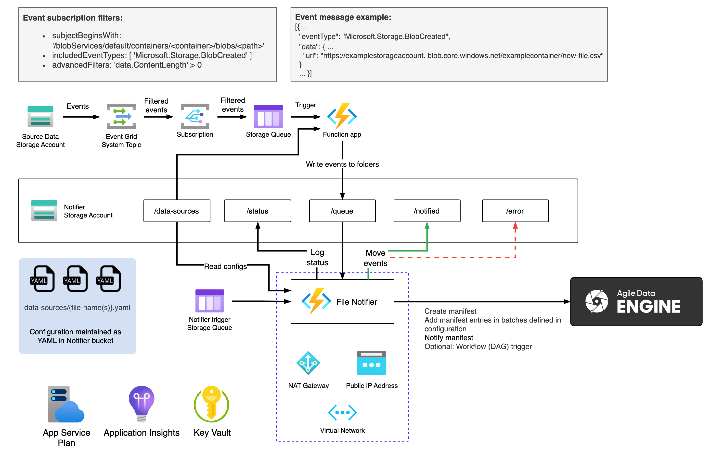

# ADE File Notifier Reference for Azure

## Architecture
A general solution architecture is presented in this diagram:

Please refer to the readme file in each [terraform module](terraform/modules/) for detailed lists of resources.

## Configuration

1. Configure your environments in [environments](environments/), see [environments/dev](environments/dev/) for reference. 

2. Configure a Terraform state storage for each environment, see [environments/dev/tfstate_storage/README.md](environments/dev/tfstate_storage/README.md).

3. Configure a [backend.conf](environments/dev/backend.conf) and a [terraform.tfvars](environments/dev/terraform.tfvars) file for each environment. Note that the configuration uses Azure Functions Flex Consumption plan by default but there is also a template for Elastic Premium plan if needed. 

4. Configure your data sources in the [config](../../config/) folder. See [README.md](../../README.md) in the root directory for instructions.

5. **Go through the configuration and ensure that it follows your policies and requirements.**

## Deployment

1. Run the Terraform deployment per environment as instructed in [terraform/README.md](terraform/README.md).

2. Deploy the Function App with Azure CLI as instructed in [terraform/README.md](terraform/README.md).