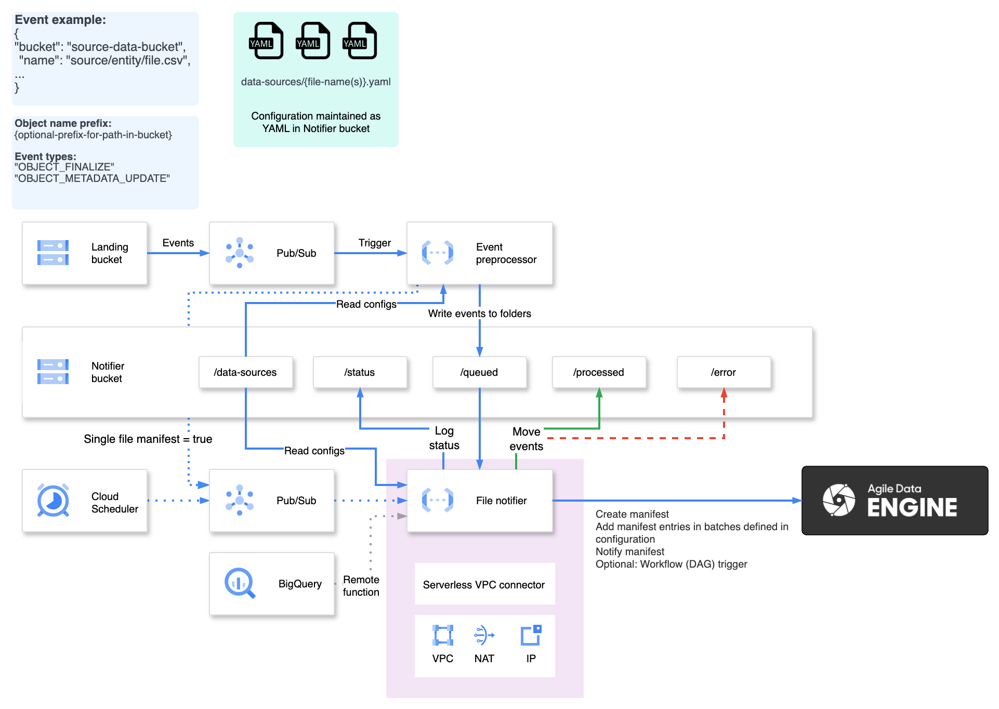

# ADE File Notifier Reference for Google Cloud

## Architecture
A general solution architecture is presented in this diagram:


Please refer to the readme file in each [terraform module](terraform/modules/) for detailed lists of resources.

## Deployment
The infrastructure and Function App deployment have been implemented with Terraform.

1. Define your environments in [environments](environments/), see [environments/dev](environments/dev/) for reference. 

2. Configure a [backend.conf](environments/dev/backend.conf) and a [terraform.tfvars](environments/dev/terraform.tfvars) file for each environment.

3. Configure your data sources in the [config](../../config/) folder. See [README.md](../../README.md) in the root directory for the configuration format.

4. Run the Terraform deployment per environment as instructed in [terraform/README.md](terraform/README.md).

## Deploying secrets
With Terraform, the secret manager secret is created as empty. You need to add the Notify API keys to the secret manager according to the example [secret_manager_example.json](secret_manager_example.json).

Tenant, service name and environment can be found from Runtime URL:s according to documentation: https://docs.agiledataengine.com/docs/ade-tenant#TenantandEnvironments-TenantserviceURLs 

## Reading log files

### Creating external table to BigQuery

Status files can be queried with BigQuery External tables. External table and view creation can be added as terraform or to your tool of choice.

Logs are partitioned to hive-partitions `status/year={year}/month={month}/day={day}`, which can be used in the external table queries.

```SQL
CREATE OR REPLACE EXTERNAL TABLE file_notifier.raw_status_files (status_content string)
WITH PARTITION COLUMNS
OPTIONS (
  format ="CSV",
  field_delimiter = '\x10', quote = '',
  uris = ['gs://reference-notifier-dev/status/*.json'],
  hive_partition_uri_prefix = 'gs://reference-notifier-dev/status',
  require_hive_partition_filter = false
  );


CREATE OR REPLACE VIEW file_notifier.ade_notifier_status AS
WITH json_data AS (
  SELECT
    JSON_QUERY_ARRAY(PARSE_JSON(status_content)) AS json_content,
    year,
    month,
    day,
    _FILE_NAME as status_file_name
  FROM file_notifier.raw_status_files
)
SELECT
    JSON_VALUE(json_record.config.id) AS config_id,
    JSON_VALUE(json_record.config.attributes.ade_source_entity) AS ade_source_entity,
    JSON_VALUE(json_record.config.attributes.ade_source_system) AS ade_source_system,
    JSON_VALUE(json_record.config.attributes.folder_path) AS folder_path,
    JSON_VALUE(json_record.config.attributes.max_files_per_manifest) AS max_files_per_manifest,
    JSON_VALUE(json_record.config.attributes.single_file_manifest) AS single_file_manifest,
    JSON_VALUE(json_record.config.manifest_parameters.format) AS manifest_format,
    JSON_VALUE(json_record.config.manifest_parameters.fullscanned) AS manifest_fullscanned,
    JSON_VALUE(json_record.config.manifest_parameters.compression) AS manifest_compression,
    JSON_VALUE(json_record.config.manifest_parameters.delim) AS manifest_delim,
    JSON_VALUE(json_record.config.manifest_parameters.skiph) AS manifest_skiph,
    JSON_VALUE(notifier.manifest_id) AS notifier_manifest_id,
    PARSE_TIMESTAMP('%Y-%m-%d %H:%M:%E6S', JSON_VALUE(notifier.notification_time)) AS notification_time,
    JSON_VALUE(entry.sourceFile) AS source_file,
    status_file_name,
    year,
    month,
    day
FROM
  json_data,
  UNNEST(json_content) AS json_record,
  UNNEST(json_query_array(json_record.notifier_manifests)) as notifier,
  UNNEST(json_query_array(notifier.entries)) as entry;

-- Example query
SELECT
  count(source_file) as file_amount_notified,
  ade_source_entity,
  ade_source_system,
  cast(notification_time as date) as notification_date
FROM file_notifier.ade_notifier_status
GROUP BY ALL
ORDER BY 1 DESC;
```

### Reading locally using DuckDB
It is efficient to read log-files using DuckDB.
- https://duckdb.org/docs/guides/network_cloud_storage/gcs_import.html
- https://console.cloud.google.com/storage/settings;tab=interoperability

```SQL
INSTALL httpfs;
LOAD httpfs;

CREATE SECRET (
      TYPE GCS,
      KEY_ID 'input-hmac-key-id',
      SECRET 'input-hmac-secret'
);

select 
    config.id, 
    config.attributes.ade_source_system, 
    config.attributes.ade_source_entity, 
    unnest(notifier_manifests, recursive:=true),
    filename as log_filename
from read_json('gs://<replace_with_your_bucket>/status/2024/*/*/*.json', filename = true);
```